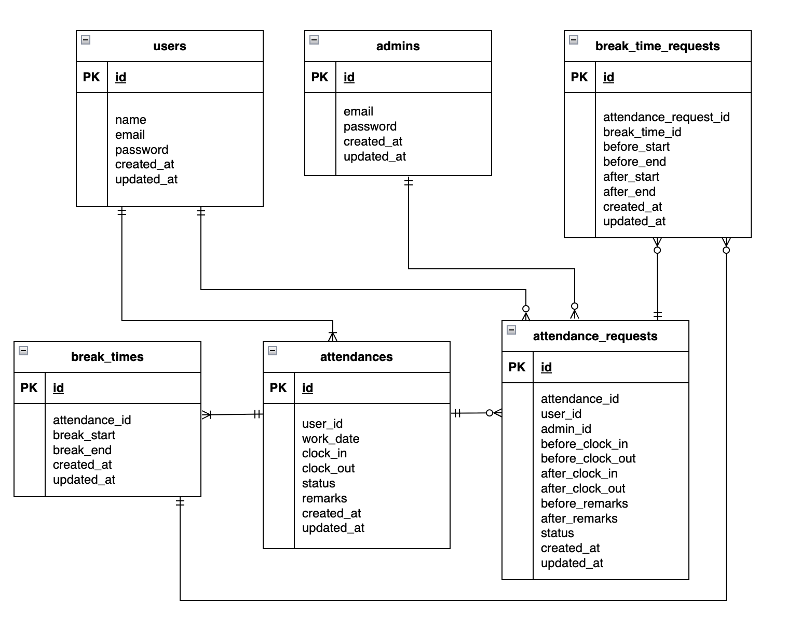

# 　勤怠アプリ

本アプリは「一般ユーザー」と「管理者ユーザー」で構成される勤怠管理システムです。
このリポジトリは **Docker + Laravel 10 + MySQL + Fortify** 環境で動作する Web アプリです。
ここでは **環境構築・テスト・メール認証** を含めて順を追って説明します。
このアプリでは **新規登録後のメール認証** を MailHog を使って確認できます。
認証が完了するとプロフィール登録画面に遷移します。

---
# 環境構築・操作手順
## 1. リポジトリのクローン

```bash
git clone git@github.com:ando625/kintai.git
cd kintai
```

---

## 2. Docker 環境起動

Docker Desktop を起動後、以下を実行：

```bash
docker compose up -d --build
```

コンテナの確認：

```bash
docker compose ps
```

`docker-compose.yml` にすでに MailHog が定義されています。
そのため、以下のコマンドで MailHog も自動で立ち上がります。

```
php         Up
mysql       Up
phpmyadmin  Up
mailhog     Up
```


---

## 3. Laravel 環境構築
この章では、Laravelを起動するために必要な初期セットアップ（依存関係のインストール、APP_KEY 生成など）を行います。

### 3-1. PHP コンテナに入る

```bash
docker compose exec php bash
```

### 3-2. Composer で依存関係をインストール

phpコンテナの中で実行

```bash
composer install
```

- Fortify もこのときに自動でインストールされます。手動で入れる必要はありません。


### 3-3. `.env` ファイル作成

```bash
cp .env.example .env
```

.env に以下を設定：

```
DB_CONNECTION=mysql
DB_HOST=mysql
DB_PORT=3306
DB_DATABASE=laravel_db
DB_USERNAME=laravel_user
DB_PASSWORD=laravel_pass
```


## 3-4. メール認証機能（MailHog使用）

- 本アプリでは 新規会員登録時および初回ログイン時にメール認証 を行います。
- メール送信のテストは MailHog を使用します。


### 確認 ブラウザで MailHog の管理画面にアクセス

- http://localhost:8025

1. SMTPサーバー: localhost:1025
2. Web UI: http://localhost:8025   → 送信された認証メールを確認可能


### Laravel 側の設定（.env）

```
MAIL_MAILER=smtp
MAIL_HOST=mailhog
MAIL_PORT=1025
MAIL_USERNAME=null
MAIL_PASSWORD=null
MAIL_ENCRYPTION=null
MAIL_FROM_ADDRESS="hello@example.com"
MAIL_FROM_NAME="${APP_NAME}"
```


### メール認証の流れ

1.	新規ユーザーを登録（メールアドレス・パスワードを入力）
2.	登録完了後、メール認証誘導画面に遷移
3.	誘導画面で「認証はこちらから」ボタンをクリックすると、MailHog が開きます。
4.	MailHog で届いた認証メールの中の「メールアドレスはこちら」or 「Verify Email Address」リンク（ボタン）をクリックして初めてメール認証が完了し、勤怠登録画面へ遷移します。


#### MailHog使用時の注意

- **稀に最初に開いたときに「認証ボタン」が表示されない場合があります。**
  - これは MailHog のレンダリングやブラウザの読み込みタイミングによる現象です。
  - 一度戻ってメールを再度開くと、ボタンが正しく表示されます。
- メール本文自体は正しく生成されており、実運用環境や他のSMTPでは問題ありません。


本アプリでは、ユーザー登録時に Laravel が自動で認証メールを送信します。
通常の会員登録ユーザーは、登録直後に MailHog へ届いたメールから認証を行ってください。
登録時から時間経過している場合は「認証メールを再送する」を押して認証してください。


Seeder で作成されたユーザーは、作成時に送られたメールの有効期限が切れている場合があるため、
ログイン後に表示される画面から **「認証メールを再送する」ボタンを押して認証してください。**


---

### 3-5. アプリケーションキー生成

```bash
php artisan key:generate
```

### 3-6. データベース準備（データベースの初期化・開発用）

開発環境で事前にダミーデータを入れるので以下を実行してください：

```bash
php artisan migrate:fresh --seed
```

### 勤怠ダミーデータについて
- 過去7か月分（2025年5月まで）の勤怠データが作成済み
- 今日以降のデータは含まれず、出勤・退勤や、土日出勤もランダム設定
- 休憩時間は12:00~13:00で設定


- 修正申請ダミーデータも作成済み
- 西伶奈の６件分の承認待ちデータが上記のコードでで作成されます


---

## 4. テスト用データベースの準備

### ⚠️ 注意
本番データベースをテストで使うのは非常に危険です。
安全にテストを実行するために、**テスト専用データベース（`demo_test`）** を作成します。

---

### 4-1. MySQLコンテナに入る

まず MySQL コンテナに接続します。
mysqlにcdで移動して↓

```bash
docker compose exec mysql bash
```

---

### 4-2. MySQL に root ユーザーでログイン

```bash
mysql -u root -p
```

パスワードは `docker-compose.yml` の中にある

```yaml
MYSQL_ROOT_PASSWORD: root
```

で設定した `root` を入力します。

---

### 4-3. テスト用データベースを作成

MySQL にログインできたら、以下を実行：

```sql
CREATE DATABASE demo_test;
SHOW DATABASES;
```

`demo_test` が一覧に表示されればOKです

---

### database.php の設定確認

`config/database.php` に以下のような **「mysql_test」設定** が追加されていることを確認してください。

（このプロジェクトではすでに設定済みです。追記する必要はありません）

```php
'mysql_test' => [
    'driver' => 'mysql',
    'url' => env('DATABASE_URL'),
    'host' => env('DB_HOST', '127.0.0.1'),
    'port' => env('DB_PORT', '3306'),
    'database' => 'demo_test',
    'username' => 'root',
    'password' => 'root',
    'unix_socket' => env('DB_SOCKET', ''),
    'charset' => 'utf8mb4',
    'collation' => 'utf8mb4_unicode_ci',
    'prefix' => '',
    'prefix_indexes' => true,
    'strict' => true,
    'engine' => null,
],
```


その後退出
```
exit  # MySQLを終了
```
---

### 4-4. `.env.testing` の作成

phpコンテナに入り、
PHP コンテナに入って、`.env` をコピーして `.env.testing` を作成します。

```bash
docker compose exec php bash
```


```cp .env .env.testing```


.env.testingを開いて、上部とDB接続部分を以下のように編集します。

```
APP_NAME=Laravel
APP_ENV=test
APP_KEY=
APP_DEBUG=true
APP_URL=http://localhost

DB_CONNECTION=mysql_test
DB_HOST=mysql
DB_PORT=3306
DB_DATABASE=demo_test
DB_USERNAME=root
DB_PASSWORD=root
```

✅ `APP_ENV` は `test` に変更


✅ `APP_KEY` は一旦空欄にしておきます


✅ `DB` も`demo_test`と`root`に設定します

---

### 4-5. テスト用アプリキーを生成
そして、先ほど「空」にしたAPP_KEYに新たなテスト用のアプリケーションキーを加えるために以下のコマンドを実行します

```bash
php artisan key:generate --env=testing
```

その後、キャッシュをクリアして反映：

```bash
php artisan config:clear
```

---

### 4-6. テスト用マイグレーション実行

```bash
php artisan migrate --env=testing
```

これで `demo_test` にテーブルが作成されます

---

### 4-7. PHPUnit の設定確認

このプロジェクトには、すでに **テスト環境用の設定済み `phpunit.xml`** が用意されています。
特に編集は不要です。内容を確認して、下記のように設定されていることを確認してください。

```xml
<php>
    <server name="APP_ENV" value="testing"/>
    <server name="BCRYPT_ROUNDS" value="4"/>
    <server name="CACHE_DRIVER" value="array"/>
    <server name="DB_CONNECTION" value="mysql_test"/>
    <server name="DB_DATABASE" value="demo_test"/>
    <server name="MAIL_MAILER" value="array"/>
    <server name="QUEUE_CONNECTION" value="sync"/>
    <server name="SESSION_DRIVER" value="array"/>
    <server name="TELESCOPE_ENABLED" value="false"/>
</php>
```

✅ `DB_CONNECTION="mysql_test"`
✅ `DB_DATABASE="demo_test"`


 この設定により、テスト実行時は
- 環境：`testing`
- 接続先DB：`mysql_test`
- 使用DB名：`demo_test`
が自動的に選ばれます。

---

### 4-8. 設定確認コマンド

もし設定が正しく反映されているか不安な場合は、
以下のコマンドで `.env.testing` と `phpunit.xml` の内容を確認できます。

```bash
docker compose exec php bash
cat .env.testing | grep DB_
grep DB_ phpunit.xml
```

結果が以下のようになっていればOKです

```
DB_CONNECTION=mysql_test
DB_DATABASE=demo_test
```
---

### これでテスト用DB環境の準備完了！

今後は以下のコマンドでテストを実行できます。

```bash
php artisan test
```


- テスト環境ではメール認証をスキップする
- 本番では EnsureEmailIsVerified ミドルウェアが有効なので、
- ログイン後の画面にアクセスするにはメール認証が必要。
- PHPUnitでの自動テストでは、メール送信や認証を経由できないため無視する。
```$this->withoutMiddleware(\Illuminate\Auth\Middleware\EnsureEmailIsVerified::class);```


### テスト環境で無効化される処理一覧
- メール送信（MAIL_MAILER=array）
- ログイン後のメール認証（EnsureEmailIsVerified）

### テスト環境のセッションについて
- PHPUnit ではセッションドライバが `array` に設定されます。
- `array` ドライバは **メモリ上だけでセッションを管理し、テスト終了と同時に消える仕組み** です。
- そのため、ログイン状態や CSRF トークンなどは永続化されず、テストごとに完全にリセットされます。
- テストの独立性を保つために必要な設定です。


---
## 5. 勤怠 CSV 出力について

管理画面の「CSV出力」ボタンを押すと、選択したユーザーの指定した月の勤怠一覧情報が CSV 形式でダウンロードできます。
ダウンロードした CSV は Excel などで開け、日ごとの勤怠を一覧で確認可能です。


### CSVの構成

| 番号 | 内容 | 例 |
|------|------|----|
| 1行目 | ユーザー名：どのユーザーの勤怠かを示すタイトル行 | ユーザー名,西 伶奈 |
| 2行目 | 列のヘッダー：各列が何を表すか | 日付,出勤,退勤,休憩,合計 |
| 3行目以降 | 日ごとの勤怠情報：1日ごとの勤務データが1行ずつ並ぶ | 2025/11/01,09:14,18:40,1:10,8:16 |


| 日付       | 出勤   | 退勤   | 休憩  | 合計  |
|------------|--------|--------|-------|-------|
| 2025/11/01 | 09:14  | 18:40  | 1:10  | 8:16  |
| 2025/11/02 | 09:30  | 18:30  | 0:50  | 8:10  |
| 2025/11/03 | 09:16  | 18:30  | 1:10  | 8:04  |


### 列の意味

| 列名       | 内容                                      |
|------------|-----------------------------------------|
| 日付       | 勤務日                                    |
| 出勤       | 出勤時刻（HH:MM形式）                     |
| 退勤       | 退勤時刻（HH:MM形式）                     |
| 休憩   | その日の休憩時間の合計（HH:MM形式）       |
| 合計   | 実働時間（出勤〜退勤 − 休憩）            |


---

## 6. テーブル

### users テーブル

| カラム名   | 型              | PRIMARY KEY | UNIQUE KEY | NOT NULL | FOREIGN KEY |
|------------|-----------------|-------------|------------|----------|--------------|
| id         | unsigned bigint | ○           |            | ○        |              |
| name       | varchar(255)    |             |            | ○        |              |
| email      | varchar(255)    |             | ○          | ○        |              |
| password   | varchar(255)    |             |            | ○        |              |
| created_at | timestamp       |             |            |          |              |
| updated_at | timestamp       |             |            |          |              |


### admins テーブル

| カラム名   | 型              | PRIMARY KEY | UNIQUE KEY | NOT NULL | FOREIGN KEY |
|------------|-----------------|-------------|------------|----------|--------------|
| id         | unsigned bigint | ○           |            | ○        |              |
| email      | varchar(255)    |             | ○          | ○        |              |
| password   | varchar(255)    |             |            | ○        |              |
| created_at | timestamp       |             |            |          |              |
| updated_at | timestamp       |             |            |          |              |


### attendances テーブル

| カラム名   | 型                                      | PRIMARY KEY | UNIQUE KEY | NOT NULL | FOREIGN KEY  |
|------------|------------------------------------------|-------------|------------|----------|---------------|
| id         | unsigned bigint                          | ○           |            | ○        |               |
| user_id    | unsigned bigint                          |             |            | ○        | users(id)     |
| work_date  | date                                     |             |            | ○        |               |
| clock_in   | datetime                                     |             |            | ○        |               |
| clock_out  | datetime                                     |             |            |          |               |
| status     | enum(off_duty,working,break,finished)    |             |            | ○        |               |
| remarks    | text                                     |             |            |          |               |
| created_at | timestamp                                |             |            |         |               |
| updated_at | timestamp                                |             |            |         |               |

### break_times テーブル

| カラム名       | 型              | PRIMARY KEY | UNIQUE KEY | NOT NULL | FOREIGN KEY      |
|----------------|-----------------|-------------|------------|----------|-------------------|
| id             | unsigned bigint | ○           |            | ○        |                   |
| attendance_id  | unsigned bigint |             |            | ○        | attendances(id)   |
| break_start    | datetime            |             |            |          |                   |
| break_end      | datetime            |             |            |          |                   |
| created_at     | timestamp       |             |            |         |                   |
| updated_at     | timestamp       |             |            |        |                   |

### attendance_requests テーブル

| カラム名         | 型                                   | PRIMARY KEY | UNIQUE KEY | NOT NULL | FOREIGN KEY      |
|------------------|---------------------------------------|-------------|------------|----------|-------------------|
| id               | unsigned bigint                       | ○           |            | ○        |                   |
| attendance_id    | unsigned bigint                       |             |            | ○        | attendances(id)   |
| user_id          | unsigned bigint                       |             |            | ○        | users(id)         |
| admin_id         | unsigned bigint                       |             |            |          | admins(id)        |
| before_clock_in  | datetime                                  |             |            |          |                   |
| before_clock_out | datetime                                  |             |            |          |                   |
| after_clock_in   | datetime                                  |             |            |          |                   |
| after_clock_out  | datetime                                  |             |            |          |                   |
| before_remarks   | text                                  |             |            |          |                   |
| after_remarks    | text                                  |             |            |          |                   |
| status           | enum(pending,approved)                |             |            |          |                   |
| created_at       | timestamp                             |             |            |         |                   |
| updated_at       | timestamp                             |             |            |         |                   |

### break_time_requests テーブル

| カラム名                 | 型              | PRIMARY KEY | UNIQUE KEY | NOT NULL | FOREIGN KEY                 |
|--------------------------|-----------------|-------------|------------|----------|------------------------------|
| id                       | unsigned bigint | ○           |            | ○        |                              |
| attendance_request_id    | unsigned bigint |             |            | ○        | attendance_requests(id)      |
| break_time_id            | unsigned bigint |             |            |          | break_times(id)              |
| before_start             | datetime            |             |            |          |                              |
| before_end               | datetime            |             |            |          |                              |
| after_start              | datetime            |             |            |          |                              |
| after_end                | datetime            |             |            |          |                              |
| created_at               | timestamp       |             |            |         |                              |
| updated_at               | timestamp       |             |            |         |                              |


---
## 7. ER図



---

## 8. phpMyAdmin

- URL: http://localhost:8080/
- ユーザー名・パスワードは `.env` と同じ
- DB: `laravel_db` を確認可能

---

## 9. 注意事項

- MySQL データは `.gitignore` により Git には含めない


### 勤怠詳細画面の編集制御(管理者・一般ユーザー共に)

勤怠詳細画面では、勤怠データが「承認待ち」の状態の場合、
修正を行えず、同一の Blade テンプレート内で以下の対応を実施しています。

- 編集フォームの各入力項目を disabled 化
- 画面下部に「承認待ちのため修正はできません。」メッセージを表示
- 状態に応じて UI の表示を切り替えることで、ユーザーが現在の状況を即座に理解できるようにしています


### 勤怠一覧画面について(管理者・一般ユーザー共に)

 注意: 勤怠がない日は時間欄は空欄です。
 **「詳細」リンクはデザイン上表示していますが、クリックできません。**


### 申請一覧画面（管理者・一般ユーザー共に）

- 承認待ち・承認済みの申請は、created_at の昇順（古い順）で配列され、配列の先頭が最古の申請、末尾が最新申請となります。
- 承認待ちも承認済みも無い場合に「申請はありません」と表示


---
## 10. 認証機能（Authentication）

本プロジェクトでは、Laravel Fortify の一部機能（新規会員登録など）を利用していますが、
**ログイン機能は Fortify を使用せず、自作の認証処理を実装**しています。

### 一般ユーザー（User）ログイン
- コントローラ: `App\Http\Controllers\User\AuthController`
- バリデーション: `App\Http\Requests\LoginRequest`
- ログイン認証処理では `Auth::guard('web')->attempt($credentials)` を使用
- セッション再生成 (`$request->session()->regenerate()`) によるセキュリティ対策済み

### 管理者（Admin）ログイン
- コントローラ: `App\Http\Controllers\Admin\AdminAuthController`
- バリデーション: `App\Http\Requests\AdminLoginRequest`
- ガード: `admin` ガードを使用（`config/auth.php` に設定）
- `Auth::guard('admin')->attempt($credentials)` により管理者認証を実施

### FormRequest の活用
各ログイン処理で **FormRequest** を使用し、以下を実現しています。
- バリデーションルールの明確化
- エラーメッセージの日本語対応
- 認証処理（`authenticate()`メソッド）をFormRequest側に分離して可読性を向上

### Fortify との使い分け
- Fortify：新規会員登録（`/user/register`）やメール認証のみ利用
- ログイン：自作コントローラ＋FormRequestで実装（Fortify側は無効化）


#### 参考
- 一般ログイン：`App\Http\Controllers\User\AuthController`
- 管理者ログイン：`App\Http\Controllers\Admin\AdminAuthController`
- Fortify設定：`App\Providers\FortifyServiceProvider`

### 一般ログインURL   http://localhost/  又は　  http://localhost/login
### 管理者ログインURL   http://localhost/admin/login


## 11. ⚠️ 管理者と一般ユーザーのログインについて（重要）
### 認証仕様
本アプリは Laravel のセッション仕様により、
**「管理者」と「一般ユーザー」を同一ブラウザで同時ログインできません。**


本アプリでは「一般ユーザー」と「管理者」の2種類の認証を用意しています。

| 種類 | ガード名 | セッション |
|------|-----------|-------------|
| 一般ユーザー | web | usersテーブル |
| 管理者 | admin | adminsテーブル |

### 理由
- Laravel は 1ドメインにつき **1つのセッション Cookie（laravel_session）** しか使用できません。
- 管理者ログアウト時にこの共通 Cookie が削除されるため、
  **一般ユーザー側の CSRF トークンが無効となり、419 エラーが発生** します。

### 発生しやすいケース
- 管理者画面と一般ユーザー画面を、同じブラウザで同時に開いている場合
- 管理者をログアウト → 一般ユーザーページでフォーム送信すると 419 となる


## 🔧 回避方法（開発時の運用）

1. **管理者と一般ユーザーを別ブラウザで確認する**
   - Chrome → 一般ユーザー
   - Safari → 管理者
   または、Chrome と Firefox など

2. **プライベートウィンドウ（シークレット）を併用する**
   - 一般ユーザー：通常ウィンドウ
   - 管理者　　　：シークレットウィンドウ

3. **セッション切れが発生した場合はページを再読み込みする**
   - CSRF トークンが再生成されるため正常に動作します


- 同じブラウザで同時に開いてる場合に管理者ログアウト後は、一般ユーザー画面をリロードしてから操作する（一般ユーザーログアウト→管理者画面リロード）


### 注意点
- **同一ブラウザで両方に同時ログインするとセッションが衝突**し、419 エラーなどが発生する可能性があります。
- **別ブラウザや別パソコンであれば衝突は起きません。**


  例：
  - 管理者（部長） → 部長のパソコンで管理者ログイン
  - 一般ユーザー（社員） → 社員のパソコンで一般ログイン
  - → 問題なし


---
## 12. テストユーザー ログイン情報

### 管理者ユーザー
- 管理者ログインURL: http://localhost/admin/login

| メールアドレス        | パスワード |
|-----------------------|------------|
| testadmin2@gmail.com  | testpass   |


**AdminSeeder.phpで作成しているのでログインする前に一度確認してください**


### 一般ユーザー
-  一般ユーザーログインURL 　 http://localhost/login
-  一般新規会員登録URL 　 http://localhost/user/register

- ダミーデータ作成時に 7 人分のユーザーが作成され、MailHog にそれぞれ認証メールが届きます。
- ログインしたユーザーのメールを開き、メール内の「Verify Email Address」リンクをクリックして認証してください。メール認証が完了し、勤怠画面に遷移します
- 他のユーザーのメールをクリックしても認証はできません。必ず ログインしたユーザーと同じメールで認証 してください。

| 名前       | メールアドレス              |
|------------|----------------------------|
| 西 伶奈    | rena.n@coachtech.com       |
| 山田 太郎  | taro.y@coachtech.com       |
| 増田 一世  | issei.m@coachtech.com      |
| 山本 敬吉  | keikichi.y@coachtech.com   |
| 秋田 朋美  | tomomi.a@coachtech.com     |
| 中西 教夫  | norio.n@coachtech.com      |
| 安倍 祐作  | yusaku.a@coachtech.com     |

- パスワードは全員共通：`password`


**UserSeeder.phpで作成しているのでログインする前に一度確認してください**


### ⚠️注意

Seeder で作成されたダミーユーザーには、作成時に一度だけ認証メールが送信されます。
ただし、このメールは 作成直後のタイミングで送られるため、ログインする頃には有効期限が切れていることが多いです。


また、認証画面の 「認証はこちらから」ボタンは MailHog を開くだけ の機能であり、認証メールを送信するものではありません。
認証メール自体は、登録時に Laravel が自動送信しています。


そのため、Seeder で作成したユーザーを使う場合は、
ログイン後の認証画面で **「認証メールを再送する」 を押して、新しく届いたメールから認証を行ってください。**


---

## 13. 使用技術

- PHP 8.1.33
- Laravel 10.49.1
- MySQL 8.0.26
- MailHog
- Laravel Fortify
- PHPUnit
- GitHub


---
## 14. 開発環境 URL

- 開発環境: http://localhost/
- phpMyAdmin: http://localhost:8080/

---
